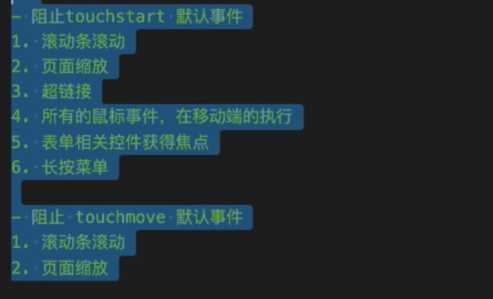
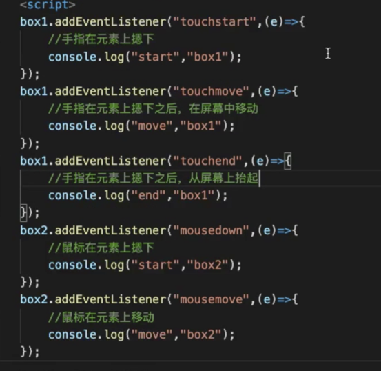

# 适配
## 像素
### 物理像素
物理像素（设备像素，device pixels）
指的是设备屏幕的物理像素，任何设备的物理像素数量都是固定的。
### CSS像素
CSS 像素（CSS pixels）
是 CSS 和 JS 中使用的一个抽象概念。它和物理像素之间的比例取决于屏幕的特性（是否为高密度）以及用户进行的缩放，由浏览器自行换算。
### 像素比
```js
console.log(window.devicePixelRatio)

//动态设置 viewport
    (function () {
        let metaEl = document.createElement('meta');
        let scale = devicePixelRatio;
        metaEl.setAttribute('name', 'viewport');
        metaEl.setAttribute('content', 'initial-scale=' + (1/scale) + ', maximum-scale=' + (1/scale) + ', minimum-scale=' + (1/scale) + ', user-scalable=no');
        document.documentElement.firstElementChild.appendChild(metaEl);
    })();
```
### 使我们CSS像素  与  物理像素统一

## 设置
### 视口设置
```html
<! - viewport 移动端特有设置，解決移动端屏幕过小，放不下正常网页的问题 -->
<! - 不设置viewport的时候，视口默认大小为 980 -->
<meta name="viewport" content="width=device-width,initial-scale=1.0,maximum-scale=1">

```


## 适配
### 百分比
### rem
```js
// 1rem = 屏幕尺寸  /  15
        (function(){
            let doc = document.documentElement;
            doc.style.fontSize = window.innerWidth / 15 + "px"
        })()
```
```css
#box div {
    width: 6.96rem;
    height: 3.6rem;
    background: red;
    margin: 0 0.2rem;
}
```
### vw
一般手机端的长度是实际设计过程中的2倍，一个手机750 * 1200分辨率，设计中为375px * 600px
375 / 100 = 3.75

50（px）/ 3.75 = 
```css
#box div {
    width: 46.4vw;
    height: 24vw;
    background: red;
    margin: 0 0.2rem;
}
```
### 媒体查询

## 移动端事件
- touchstart 手指触碰
- touchmove 手指移动
- touchend 手指弹起
```js
document.addEventListener('touchstart',e => e.preventDefault(),{passive:false})
let box = document.getElementById("box");
        box.addEventListener('touchmove', function( event){
            console.log(event.changedTouches.length)
            console.log(event.targetTouches.length)
            console.log(event.touches.length)
        })
        box.addEventListener('touchend',function( event){
            console.log(event)
        })
```
- touchEvent
  - changedTouches 触发当前事件的手指列表
  - targetTouches 当前元素上的手指列表
  - touches 当前屏幕的手指列表


